# sharks
<!DOCTYPE html>

<html>
    <head>
        <meta charset="utf-8">
        <title>Саит об акулах</title>
    </head>

        <body>

          
          

              В настоящее время известно более 450 видов акул.
              Их разделяют на 8 отрядов:  Кархаринообразные, Катранообразные,
              Многожаберниковообразные, Пилоносообразные,  Разнозубообразные,
              Скватинообразные, Ламнообразные.
          

              Также их делят на 32 семейства.
              <h1>Катранообразные</h1>
              
               <h1> Многожаберниковообразные</h1>
           
          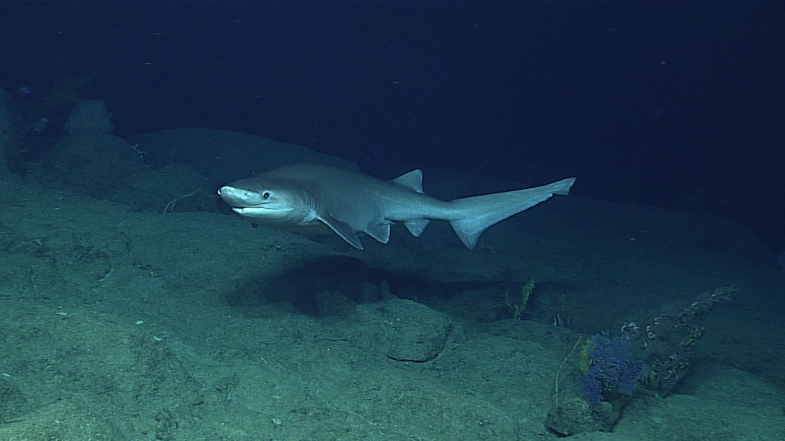
          <h1>Пилоносообразные</h1>
              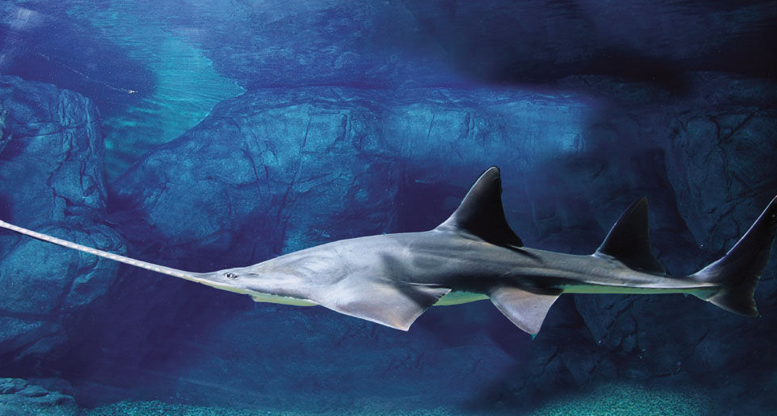
            
           <h1>Ламнообразные</h1>
              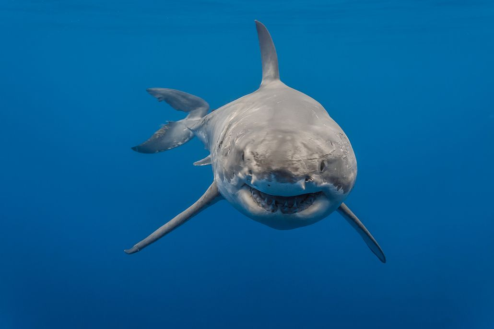
            
           <h1>Кархаринообразные</h1>
              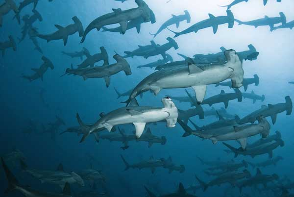

           
          

              Вот фотографии некоторых акул.Размеры акул варьируют от миниатюрных, с человеческую ладонь, до огромных, превышающих размером автобус. Самые маленькие акулы едва достигают 10-15 см в длину, самые большие - достигают 20 м. Но основная часть видов акул имеют размеры, сравнимые с человеческими - 1.2-2.0 м. в длину.
          
          

              Акулы имеют широкий спектр форм тела.
Большинство видов акул имеют торпедообразное или сигарообразное тело, что позволяет им легко скользить в толще воды.
Скватиновые акулы, или акулы-ангелы, имеют уплощенную форму, подобно скатам, что позволяет им прятаться в грунте и с успехом вести донный образ жизни.
Некоторые акулы обладают совершенно необычной формой тела - рыба-молот обладает чрезвычайно широкой и плоской Т-образной головой, акула-пилонос - вытянутым острым носом, оснащенным зубами, акула-домовой (или гоблин), а также плащеносная акула - совершенно необычную, пугающую внешность.
 

           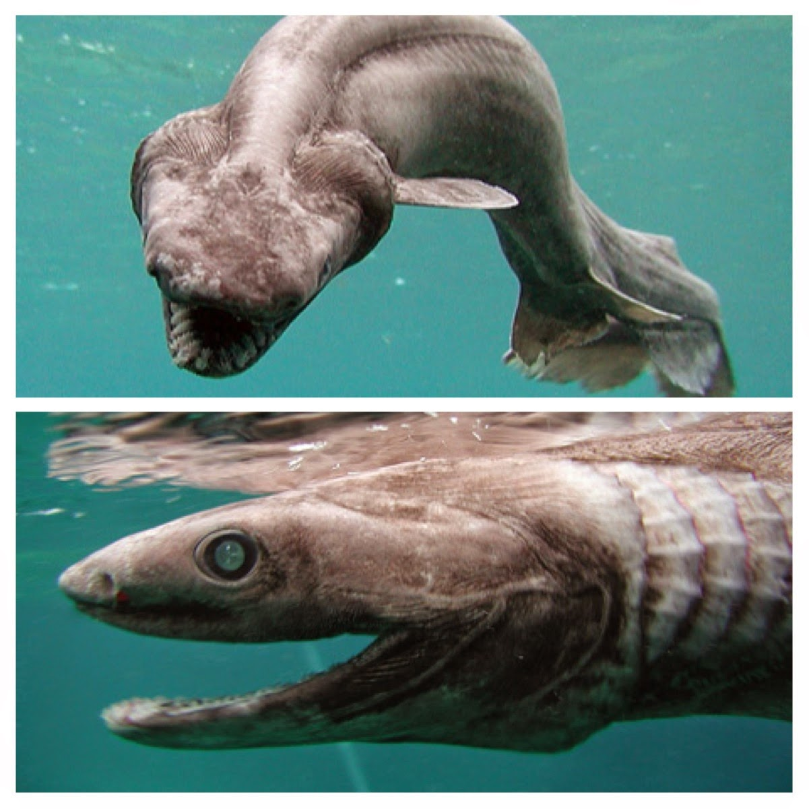
           
Рацион разных видов акул может сильно отличаться, но все они - плотоядные животные. Некоторые (например, большие белые, тигровая и рыба-молот) являются быстрыми хищниками, питающимися рыбой, кальмарами, другими акулами и морскими млекопитающими.
Многие представители надотряда, например, зебровая, морской ангел и др. являются медленно плавающими хищниками, питающимися донными беспозвоночными - ракообразными, моллюсками, морскими червями, змеями, ежами и т.д.
Есть среди акул и разновидности (китовая, гигантская, большеротая) предпочитают в качестве основного блюда планктон - мельчайшие морские организмы.
  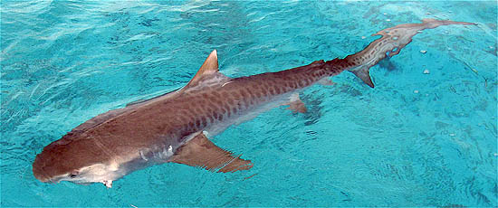
<h1>Распространённые заблуждения об акулах</h1>
Акула должна постоянно плыть, чтобы дышать и оставаться живой. На самом деле многие виды способны отдыхать, лёжа на дне и прокачивая воду через жабры. Причём предпочитают именно такой способ дыхания вместо движения.

Большинство акул нападают на человека и убивают его. Всего несколько видов акул регулярно совершают неспровоцированные нападения на людей, и в основном это происходит из-за ошибки в идентификации добычи.

    Акулы обожают человеческую кровь. Акулы не отдают предпочтение какой-либо крови. Напротив, отхватив от человека кусок плоти, они обычно выплевывают его обратно, потому что это мясо не является той высокожирной пищей, которая необходима им для пополнения запасов энергии.

    Акулы не подвержены раковым заболеваниям. Это убеждение, существовавшее долгое время, стало причиной гибели огромного количества акул, вылавливаемых человеком ради «противоракового» хряща. Однако наблюдение за акулами в неволе, так же как и в естественной среде обитания, показали наличие особей с органами, поражёнными раковыми опухолями. Количество случаев раковых заболеваний оказалось больше там, где вода больше загрязнена (в том числе, и в результате деятельности человека).
<h1>Экология и охрана</h1>

    Большинство акул находятся на вершине пищевой цепочки или близко к ней. Поэтому они играют огромную роль в регуляции количества тех видов, на которые охотятся. Но, как и всех обитателей моря, антропогенный фактор не обошёл стороной и акул. На них также оказывают влияние растущий промысел их естественной пищи, загрязнение окружающей среды и непосредственная охота на самих акул, в частности на их плавники.

Для человека они потенциально полезны в медицине и применяются в качестве пищи. Исторически вылов акул производился в относительно небольших масштабах и не составлял проблем для восстановления их численности. Однако возросший с 80-х годов XX века промысел поставил под угрозу многие виды[46]. Одна из причин роста популярности акул в качестве объекта промысла — это их плавники. Суп из акульих плавников считается деликатесом, и плавник по стоимости выше акульего мяса. Это привело к негуманному способу охоты за плавниками, которые добывают, срезая их с живой рыбы, а саму акулу при этом выбрасывая обратно в море. В настоящее время в некоторых странах такой вид ловли уже запрещён.
 
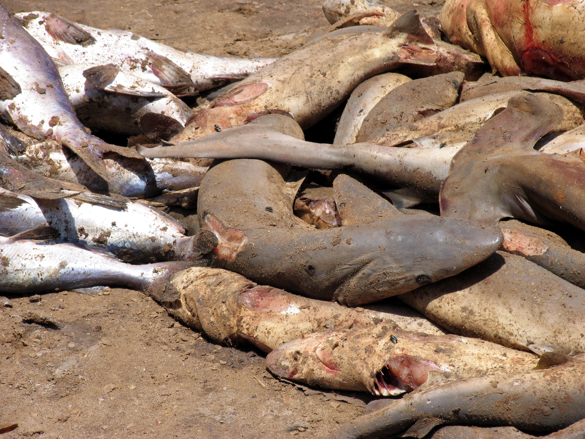

В то же время не только целенаправленный вылов акул является для них угрозой — около половины вылавливается неумышленно вместе с другой рыбой. В отличие от промышленной добычи рыбы, такой вылов акул гораздо сложнее контролировать и регулировать рыбной индустрии. Как правило, вылов рыбы в больши́х количествах регулируется властями. Однако исторически учёт случайно выловленных акул обычно не вёлся из-за относительно небольшого их количества. Существенный ущерб их популяции наносится в результате т. н. прилова при ярусном лове. При таком лове пелагических промысловых рыб акулы составляют значительную часть добычи. К примеру, в Австралии при промысле этим способом тунца и марлиновых рыб прилов акул составляет более 25 %, а в районе Гавай при добыче меч-рыбы — 32 %. Самую большую долю жертв среди видов составляют голубые акулы — от 47 % до 92 % прилова при проведении исследований. Около 6 миллионов голубых акул ежегодно попадается в сети как случайная добыча. Размер прилова акул зависит от типа орудий лова и мест промысла. Больше акул вылавливается при добыче у поверхности моря, чем в глубине[47].
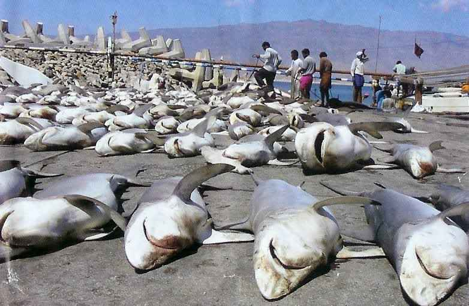
 
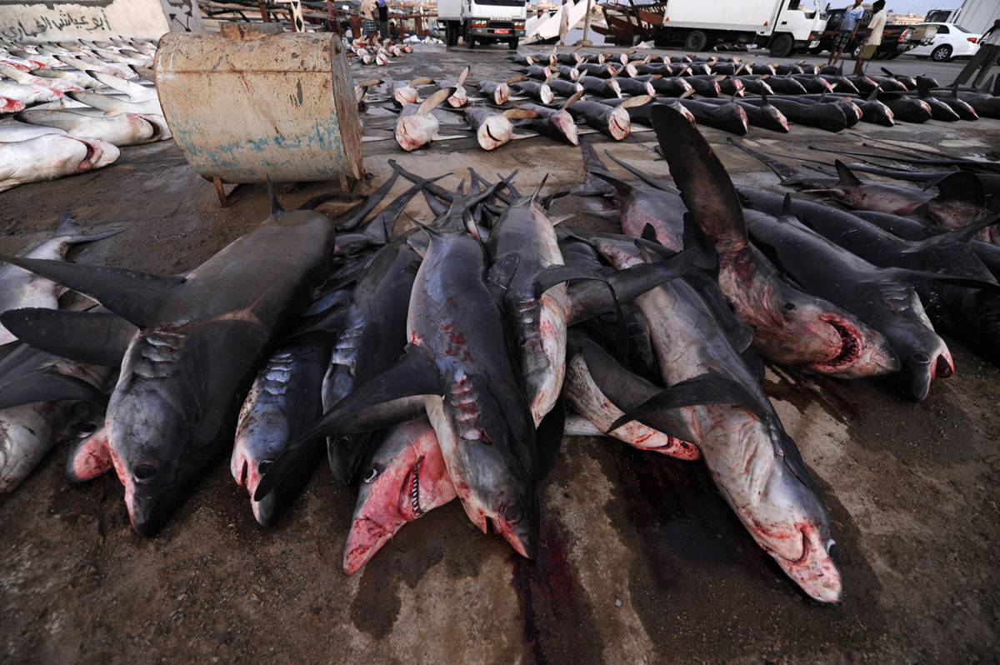
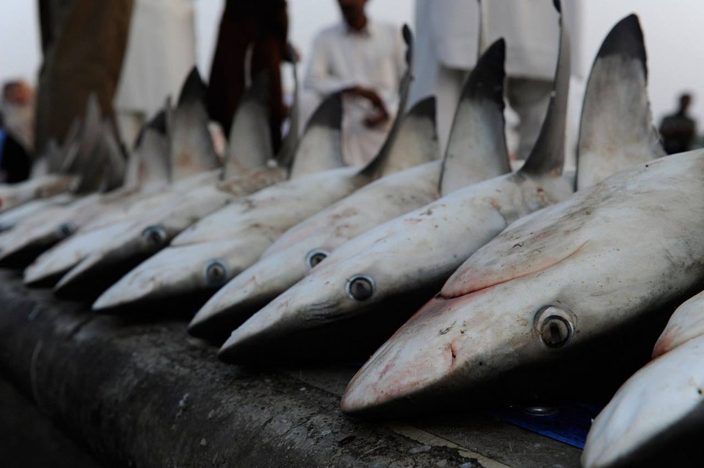
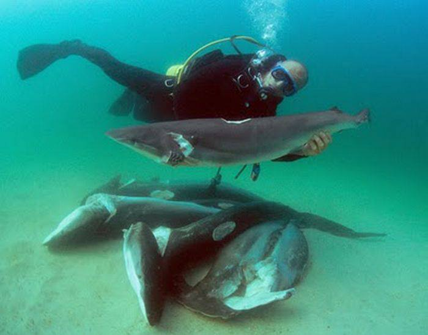
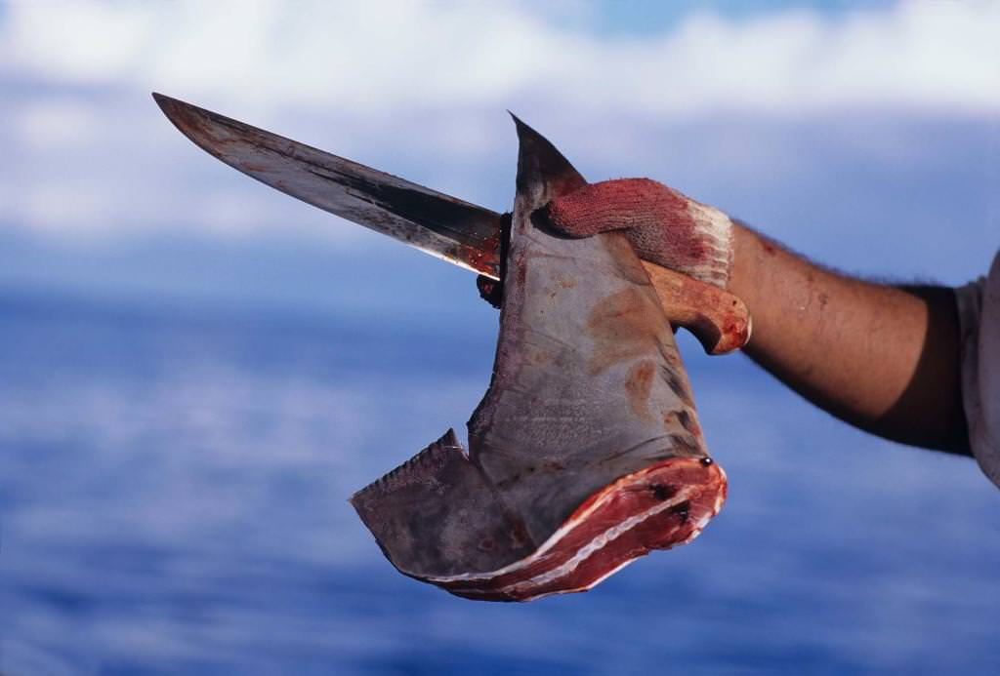

    За 1 год погибает 100 000 000 акул!
           
           <a href="http://scharks.ru/vidy/"><h1>Подробние об акулах</h1></a>
        </body>
</html>
